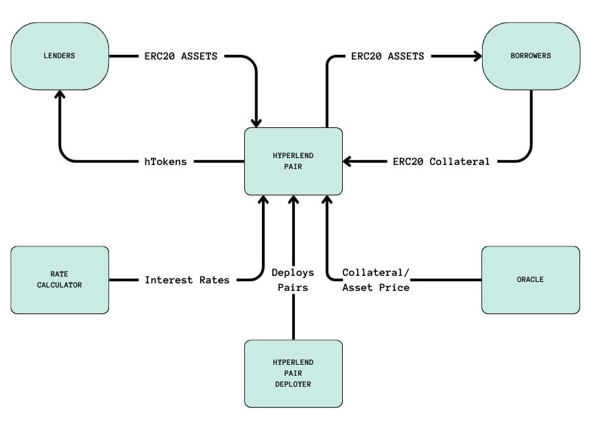

# HyperLend Isolated

 

### Introduction to HyperLend Isolated

HyperLend Isolated is a lending platform (fork of [FraxLend](https://docs.frax.finance/fraxlend/fraxlend-overview) V3) that allows users to create an isolated market between a pair of ERC-20 tokens. 

HyperLend Isolated adheres to the EIP-4626: Tokenized Vault Standard, lenders are able to deposit ERC-20 assets into the pair and receive yield-bearing hTokens.  

## Overview

 

### Building and Testing

- Copy `.env.example` to `.env` and fill in the mnemonic
- Run `npm install`

Compilation

- `npx hardhat compile`

Tests

- `npx hardhat test`

 

### License
Permission to use, copy, modify, and/or distribute this software for any purpose with or without fee is hereby granted, provided that the above copyright notice and this permission notice appear in all copies.

THE SOFTWARE IS PROVIDED "AS IS" AND THE AUTHOR DISCLAIMS ALL WARRANTIES WITH REGARD TO THIS SOFTWARE INCLUDING ALL IMPLIED WARRANTIES OF MERCHANTABILITY AND FITNESS. IN NO EVENT SHALL THE AUTHOR BE LIABLE FOR ANY SPECIAL, DIRECT, INDIRECT, OR CONSEQUENTIAL DAMAGES OR ANY DAMAGES WHATSOEVER RESULTING FROM LOSS OF USE, DATA OR PROFITS, WHETHER IN AN ACTION OF CONTRACT, NEGLIGENCE OR OTHER TORTIOUS ACTION, ARISING OUT OF OR IN CONNECTION WITH THE USE OR PERFORMANCE OF THIS SOFTWARE.
